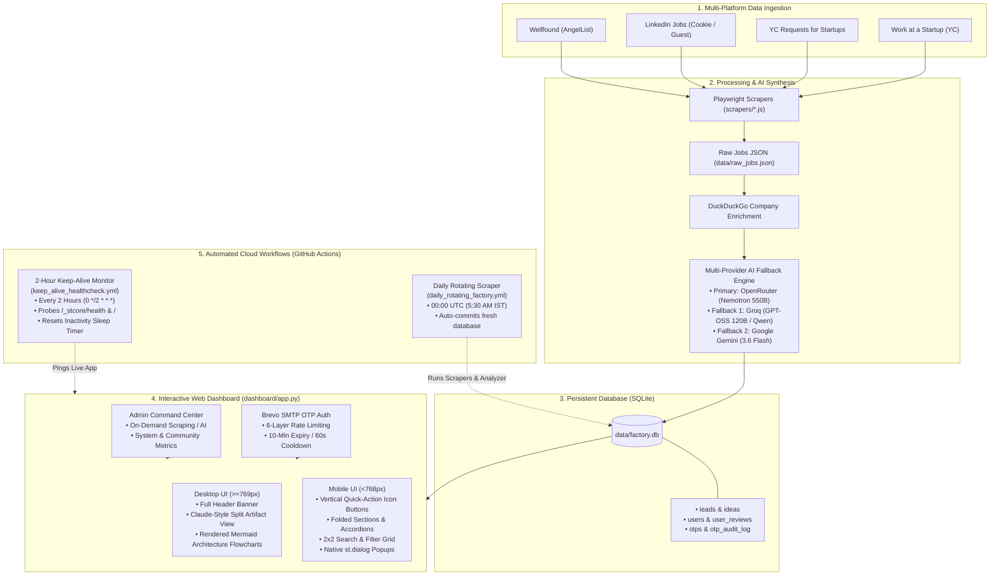

# 🚀 Product-a-Day Idea Factory

An automated, end-to-end intelligence pipeline that reverse-engineers hiring needs and job descriptions from top startup platforms (**Y Combinator, Work at a Startup, LinkedIn, Wellfound, YC RFS**) into validated, build-ready product opportunities.

Equipped with a modern **Streamlit Web Dashboard**, **Passwordless Brevo SMTP OTP Authentication**, **Multi-User Review Isolation**, **Admin Command Center**, **Claude-Style Split Artifact Inspector**, **Mobile-Responsive Adaptive UI**, and an **Automated 2-Hour Keep-Alive Health Monitor** on GitHub Actions to prevent Streamlit Community Cloud sleep mode.

---

## ⚡ Architecture Overview



---

## 🎯 Key Features

### 1. 🔐 Passwordless Brevo SMTP OTP Authentication
- **1-Click Magic Code Login**: Users enter their email and receive a cryptographically generated 6-digit numeric OTP via Brevo (Sendinblue) free SMTP relay.
- **6-Layer Anti-Abuse Rate Limiting**:
  1. **Cryptographic Generation**: Uses Python's `secrets.randbelow` to eliminate PRNG predictability.
  2. **10-Minute Code Expiration**: Expired tokens are purged and immediately rejected.
  3. **60-Second Cooldown**: Enforces a strict one-minute wait period before another OTP can be requested.
  4. **Hourly Burst Limit**: Hard cap of 5 OTP requests per email address per rolling hour.
  5. **Global Daily Safety Cap**: Max 280 OTP dispatches per calendar day to stay strictly within Brevo's 300 free daily email quota.
  6. **5-Guess Lockout**: Accounts are locked for 15 minutes after 5 consecutive incorrect OTP entries.
- **Privacy First**: Sender identity and email transport details are encapsulated server-side without client exposure.
- **Resend API Fallback**: Automatically switches to Resend API if SMTP relay credentials are not configured.

### 2. 👥 Multi-User Review Isolation & Community Analytics
- **Personalized Founder Decision Board**:
  - Each logged-in user maintains an independent review record for every idea: **`🔨 Build`**, **`❌ Skip`**, or **`⏳ Unreviewed`**.
  - Private notes, rationale, and timestamps are saved directly to the user's isolated `user_reviews` table.
- **Guest Browsing Mode**:
  - Unauthenticated visitors can freely browse, filter, search, and inspect ideas in read-only mode.
- **Community Analytics Engine**:
  - Aggregates real-time review statistics across all registered founders to reveal top-voted product concepts.

### 3. 🛡️ Founder & Admin Command Center
- **Protected Administrator Access**:
  - Restricted to designated admin emails (e.g., `warrioratul7146@gmail.com`, `rajatul.official@gmail.com`).
- **On-Demand Operational Controls**:
  - Run scraper pipelines manually from the web UI.
  - Trigger the multi-provider AI analyzer on unanalyzed jobs.
  - Clear Streamlit cache and reload factory database with 1 click.
  - Live system health metrics, OTP audit log inspection, and registered user counters.

### 4. 📱 Mobile-First Adaptive Design
- **Zero Desktop Regressions**: Preserves the full-featured desktop experience (header banner, metric cards, 3-column filters, Claude split-view inspector).
- **Folded Layout Architecture**:
  - Filters and metrics are folded by default into collapsible accordions to prevent mobile scroll fatigue.
- **Vertical Quick-Action Icon Buttons**:
  - Mobile header features two compact 40x40px rounded box icon buttons vertically stacked beside the title:
    - `:material/account_circle:` / `:material/login:` — Opens the Auth & Profile modal.
    - `:material/bar_chart:` — Opens the Community Metrics dialog.
- **2×2 Filter Grid**:
  - Search keywords, platform selectors, decision filters, and sort options are neatly organized into an ergonomic 2×2 mobile layout.
- **Compact Pagination**:
  - Bulky desktop pagination widgets are replaced on mobile with lightweight rounded pill buttons (`Prev`, `Next`, `Export CSV`).

### 5. 🩺 2-Hour Keep-Alive Health Monitor
- **Prevents Streamlit Cloud Sleep Mode**:
  - Free Streamlit Community Cloud deployments automatically enter hibernation after periods of user inactivity.
  - An automated GitHub Actions workflow (`.github/workflows/keep_alive_healthcheck.yml`) runs **every 2 hours (`0 */2 * * *`)** to reset the inactivity timer.
- **Dual-Layer Health Verification**:
  - **Layer 1 (Core Health)**: Probes `https://idea-a-day.streamlit.app/_stcore/health` with 3 retries and 15-second backoff.
  - **Layer 2 (App Warm-Up)**: Sends a browser User-Agent GET request to `https://idea-a-day.streamlit.app/` to warm up memory and Python session caches.
- **GitHub Step Summary**: Automatically produces a formatted uptime report in the Actions job log on every ping.

### 6. 🤖 Multi-Provider AI Fallback Engine
- **Primary Model**: `nvidia/nemotron-3-ultra-550b-a55b:free` via OpenRouter.
- **High-Speed Fallback 1**: `openai/gpt-oss-120b` or `qwen/qwen-2.5-72b-instruct` via Groq.
- **Secondary Fallback 2**: `gemini-2.5-flash` via Google GenAI SDK.
- **Synthesis Artifacts**:
  - Core Market Pain Point & Gap Analysis
  - Standalone Zero-to-One Product Solution
  - Interactive Mermaid.js System Architecture Diagram
  - Recommended Tech Stack & MVP Feasibility Score
  - Downloadable Founder Build Blueprint (Markdown & CSV)

---

## 🛠️ Local Quickstart

### Prerequisites
- **Node.js**: v18.0 or higher
- **Python**: v3.10 or higher
- **Playwright Chromium**: For browser scraping

### 1. Clone & Install Dependencies

```bash
# Clone the repository
git clone https://github.com/YourUsername/Product_a_day_idea_factory.git
cd Product_a_day_idea_factory

# Install Node.js dependencies & Playwright browsers
npm install
npx playwright install chromium

# Create and activate Python virtual environment
python -m venv .venv
source .venv/bin/activate  # On Windows: .venv\Scripts\activate

# Install Python dependencies
pip install -r requirements.txt
```

### 2. Configure Environment Variables

Create a `.env` file in the project root (see [`.env.example`](file:///d:/Dev_Lakshman/Product_a_day%20_idea_factory/.env.example)):

```env
# AI Providers (At least one required)
OPENROUTER_API_KEY=sk-or-v1-your-openrouter-key
GROQ_API_KEY=gsk_your-groq-key
GEMINI_API_KEY=AIzaSy-your-gemini-key

# Product Stack Preferences
KNOWN_STACK=Node.js, Python, React

# Administrator Access
ADMIN_EMAIL=warrioratul7146@gmail.com,rajatul.official@gmail.com

# Email Authentication: Brevo Free SMTP Relay (300 free emails/day)
SMTP_HOST=smtp-relay.brevo.com
SMTP_PORT=587
SMTP_USER=your_brevo_smtp_login
SMTP_PASSWORD=your_brevo_smtp_master_key
SMTP_FROM_EMAIL=Product Idea Factory <noreply@yourdomain.com>

# Optional Email Fallback: Resend API
RESEND_API_KEY=re_your_resend_key
RESEND_FROM_EMAIL=Product Idea Factory <onboarding@resend.dev>
```

### 3. Generate Scraper Auth Cookies (Optional for LinkedIn/Wellfound)

```bash
node scrapers/auth_manager.js
```
*Opens interactive browser tabs for YC, LinkedIn, and Wellfound. Once logged in, press ENTER in the terminal to save `data/auth_state.json` and generate `data/auth_state.b64.txt`.*

### 4. Run Scrapers & AI Analysis

```bash
# Run individual scrapers
node scrapers/yc_scraper.js
node scrapers/yc_rfs_scraper.js
node scrapers/linkedin_scraper.js
node scrapers/wellfound_scraper.js

# Run AI Analyzer Engine to synthesize new ideas
python engine/analyzer.py
```

### 5. Launch the Dashboard

```bash
python -m streamlit run dashboard/app.py
```
Open **`http://localhost:8501`** in your browser.

---

## ☁️ Cloud Deployment & Execution Guide

### Part 1: Deploy on Streamlit Community Cloud

1. Push your repository to GitHub:
   ```bash
   git add .
   git commit -m "Deploy Product Idea Factory with Brevo OTP & Health Monitor"
   git push origin main
   ```
2. Navigate to **[share.streamlit.io](https://share.streamlit.io/)** and log in with GitHub.
3. Click **"New app"** and configure:
   - **Repository**: `YourUsername/Product_a_day_idea_factory`
   - **Branch**: `main`
   - **Main file path**: `dashboard/app.py`
   - **App URL**: `idea-a-day.streamlit.app` (or your preferred subdomain)
4. Under **Advanced settings > Secrets (TOML)**, paste your production secrets:

```toml
# ==============================================================================
# STREAMLIT COMMUNITY CLOUD SECRETS (secrets.toml)
# ==============================================================================

# AI Inference Keys (At least one required)
OPENROUTER_API_KEY = "sk-or-v1-xxxxxxxxxxxxxxxxxxxxxxxxxxxxxxxx"
GROQ_API_KEY = "gsk_xxxxxxxxxxxxxxxxxxxxxxxxxxxxxxxx"
GEMINI_API_KEY = "AIzaSyxxxxxxxxxxxxxxxxxxxxxxxxxxxx"
KNOWN_STACK = "Node.js, Python, React"

# Admin Whitelist
ADMIN_EMAIL = "warrioratul7146@gmail.com,rajatul.official@gmail.com"

# Brevo Free SMTP Relay (300 emails/day, 100% free)
SMTP_HOST = "smtp-relay.brevo.com"
SMTP_PORT = "587"
SMTP_USER = "your_brevo_smtp_user@smtp-brevo.com"
SMTP_PASSWORD = "xsmtpsib-your-brevo-master-smtp-key"
SMTP_FROM_EMAIL = "Product Idea Factory <your_verified_sender@gmail.com>"

# Optional Fallback: Resend API
RESEND_API_KEY = "re_xxxxxxxx"
RESEND_FROM_EMAIL = "Product Idea Factory <onboarding@resend.dev>"
```
5. Click **Deploy**. Your app will be live at `https://idea-a-day.streamlit.app`.

---

### Part 2: Configure GitHub Actions Secrets & Variables

Navigate to your GitHub repository **Settings > Secrets and variables > Actions**:

#### 1. Repository Secrets (`New repository secret`)
| Secret Name | Description | Example / Origin |
| :--- | :--- | :--- |
| `OPENROUTER_API_KEY` | Primary AI inference model | `sk-or-v1-...` |
| `GROQ_API_KEY` | High-speed AI inference fallback | `gsk_...` |
| `GEMINI_API_KEY` | Secondary AI inference fallback | `AIzaSy...` |
| `AUTH_STATE_BASE64` | Encrypted session cookies for LinkedIn/Wellfound | Content of `data/auth_state.b64.txt` |
| `APP_URL` | *(Optional)* Target URL for the Keep-Alive health monitor | Defaults to `https://idea-a-day.streamlit.app` |

#### 2. Workflow Permissions
To allow the daily scraper workflow to automatically commit fresh ideas back to your GitHub repository:
1. Go to **Settings > Actions > General**.
2. Scroll to **Workflow permissions**.
3. Select **"Read and write permissions"**.
4. Check **"Allow GitHub Actions to create and approve pull requests"** and click **Save**.

---

### Part 3: Free Brevo SMTP Relay Setup Guide (5 Minutes)

1. **Sign Up**: Create a free account at [brevo.com](https://www.brevo.com/) (formerly Sendinblue). The free tier provides **300 free emails per day forever**.
2. **Verify Sender Email**:
   - In Brevo, go to **Senders, Domains & Dedicated IPs > Senders**.
   - Add and verify your personal or work email address (e.g. `yourname@gmail.com`).
3. **Get SMTP Credentials**:
   - Go to **SMTP & API > SMTP tab**.
   - Copy your **SMTP Server** (`smtp-relay.brevo.com`), **Port** (`587`), and **Login** (`SMTP_USER`).
   - Click **Generate a new SMTP key**, name it `idea-factory-otp`, and copy the generated key (`SMTP_PASSWORD`).
4. **Add to Streamlit Secrets**:
   - Set `SMTP_FROM_EMAIL = "Product Idea Factory <your_verified_email@gmail.com>"`.
   - Paste the credentials into Streamlit Cloud Secrets.

---

### Part 4: Verifying the 2-Hour Keep-Alive Health Monitor

The keep-alive monitor runs automatically on a cron schedule (`0 */2 * * *`). You can also trigger it manually at any time:
1. In your GitHub repository, navigate to the **Actions** tab.
2. Under **Workflows**, select **Streamlit Cloud Keep-Alive & Health Monitor**.
3. Click **Run workflow**, verify the target URL (`https://idea-a-day.streamlit.app`), and click **Run workflow**.
4. Click into the executing run to view the step outputs:
   - `🩺 Probe Streamlit Core Health Endpoint`: Checks `/_stcore/health` (HTTP 200 OK).
   - `🚀 Warm Up Main Web App`: Executes a browser User-Agent GET request to reset the idle timer.
   - `📋 Publish Execution Summary`: Emits an execution table in the GitHub Actions summary.

---

## 📅 Rotating 4-Day Schedule Breakdown

The daily pipeline (`.github/workflows/daily_rotating_factory.yml`) executes every morning at **00:00 UTC (5:30 AM IST)**:

| Day Index (`DayOfYear % 4`) | Scraper Executed | Target Content |
| :---: | :--- | :--- |
| **Day 0** | **Work at a Startup (YC)** | Founding Engineer, Product Manager, & GTM roles across funded YC startups |
| **Day 1** | **YC Requests for Startups (RFS)** | 100% Public YC problem areas where partners actively want startups built |
| **Day 2** | **LinkedIn Jobs** | Fresh role postings extracted via authenticated session cookies |
| **Day 3** | **Wellfound (AngelList)** | Early-stage hiring posts with Cloudflare challenge handling |

*After each scraper run, `engine/analyzer.py` synthesizes new listings with the AI fallback engine, updates `data/factory.db`, and commits changes to GitHub.*

---

## 📂 Project Structure

```
├── .github/
│   └── workflows/
│       ├── daily_rotating_factory.yml # 4-day rotating scraping & AI synthesis workflow
│       └── keep_alive_healthcheck.yml # 2-hour keep-alive health check & sleep-mode prevention
├── .streamlit/
│   └── config.toml                    # Streamlit visual theme & server configurations
├── dashboard/
│   ├── app.py                         # Streamlit UI with Split-View Claude Inspector & Mobile Layout
│   ├── auth.py                        # Brevo SMTP OTP Auth, 6-layer rate limiting & session state
│   ├── db.py                          # SQLite multi-user database operations & schema migrations
│   └── assets/
│       └── logo.png                   # AI-generated glowing product factory brand logo
├── data/
│   ├── factory.db                     # SQLite database (leads, ideas, users, reviews, otps)
│   ├── raw_jobs.json                  # Ingested raw job postings
│   ├── auth_state.json                # Local scraper session cookies (gitignored)
│   └── auth_state.b64.txt             # Gzip-compressed Base64 secret string (gitignored)
├── engine/
│   └── analyzer.py                    # Multi-provider AI gap analysis & JSON synthesis
├── scrapers/
│   ├── auth_manager.js                # Interactive multi-platform login & cookie compressor
│   ├── linkedin_scraper.js            # LinkedIn Playwright scraper
│   ├── wellfound_scraper.js           # Wellfound Playwright scraper
│   ├── yc_scraper.js                  # Work at a Startup scraper
│   └── yc_rfs_scraper.js              # YC Requests for Startups scraper
├── .env.example                       # Environment variables template
├── .gitignore                         # Secret protection & ignored build artifacts
├── package.json                       # Node dependencies (Playwright)
├── requirements.txt                   # Python dependencies (Streamlit, Pandas, GenAI, Groq)
└── README.md                          # Full project documentation & execution guide
```

---

## 📄 License
MIT License. Built for builders, founders, and product engineers.
